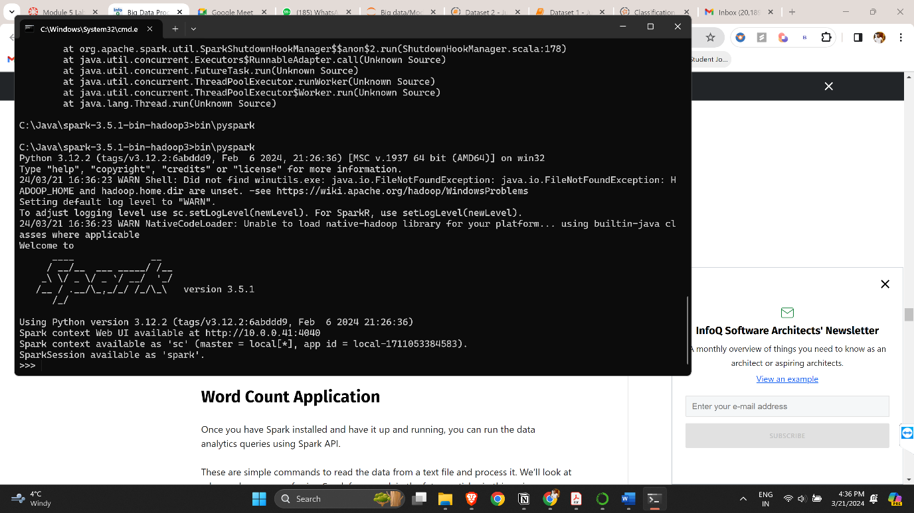
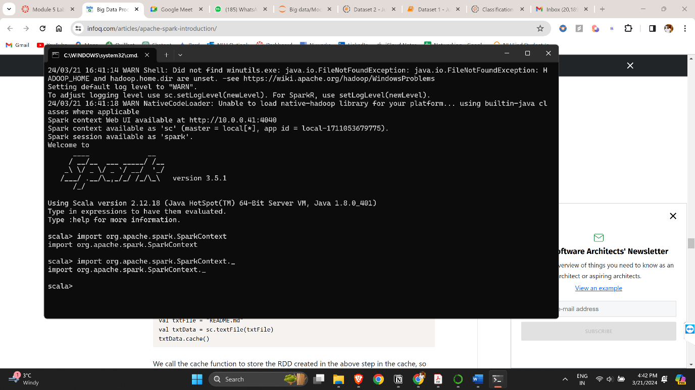
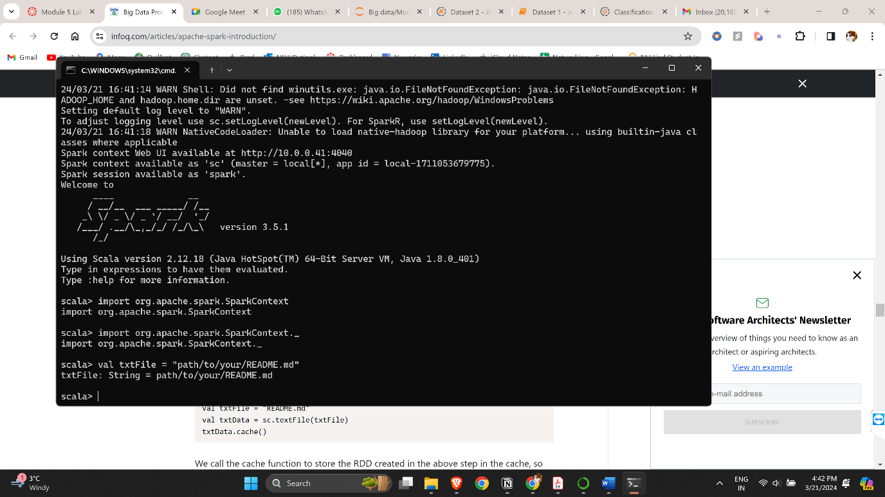
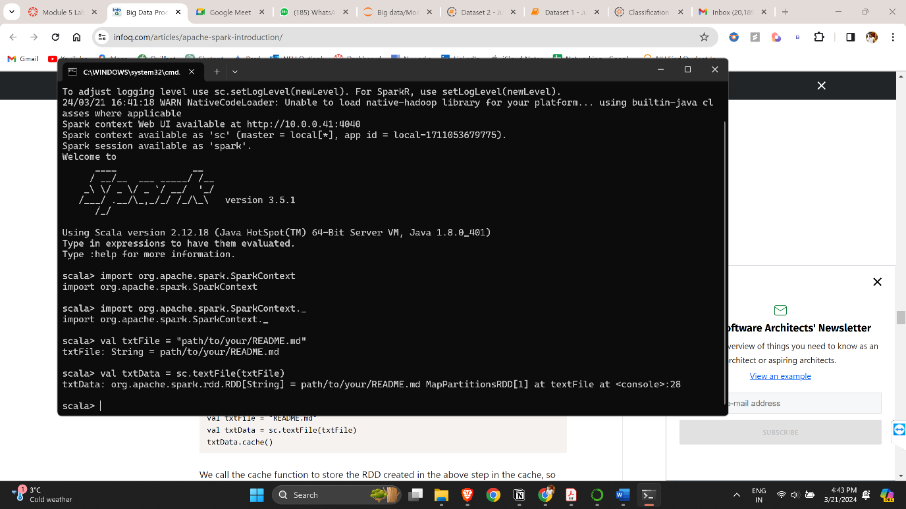
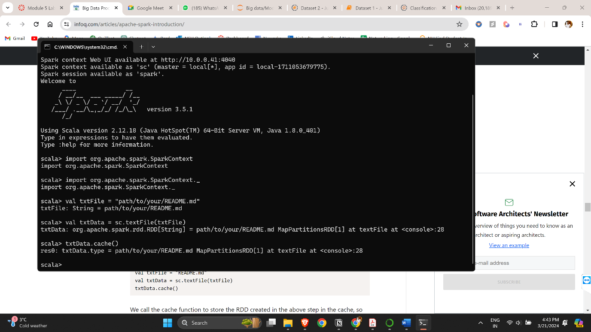
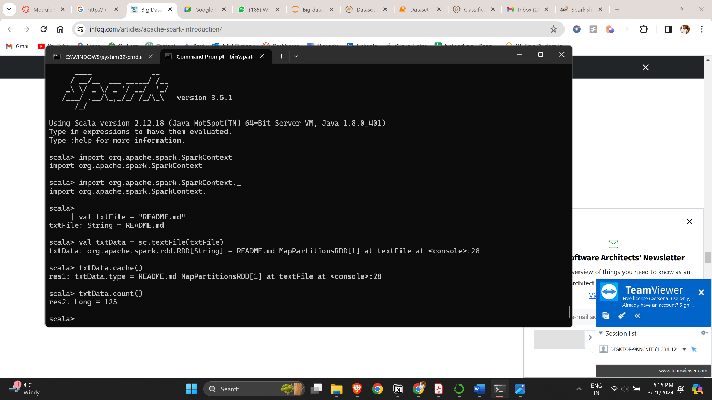
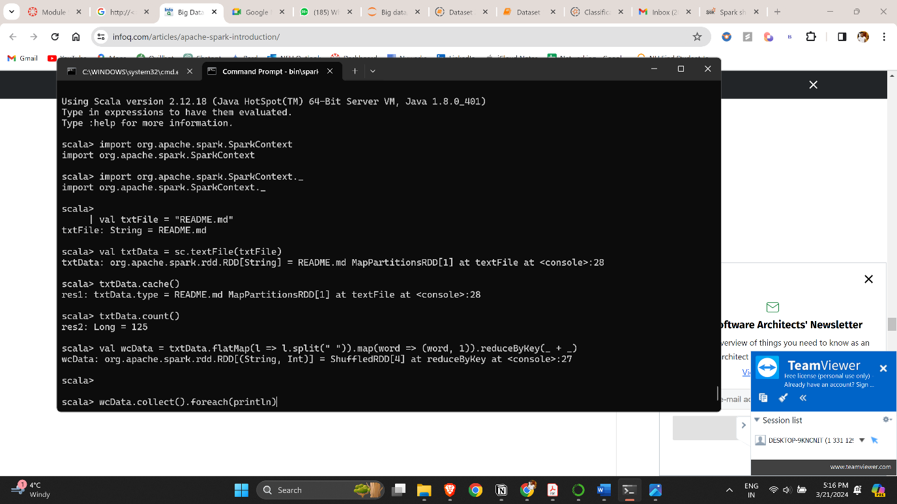
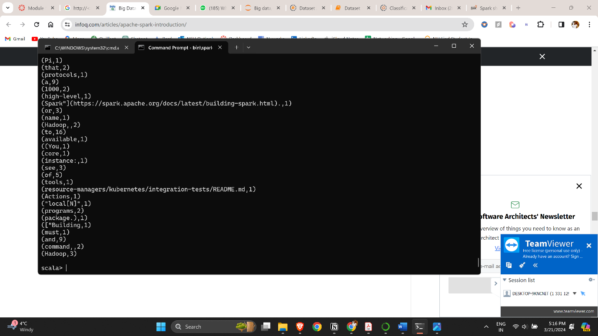
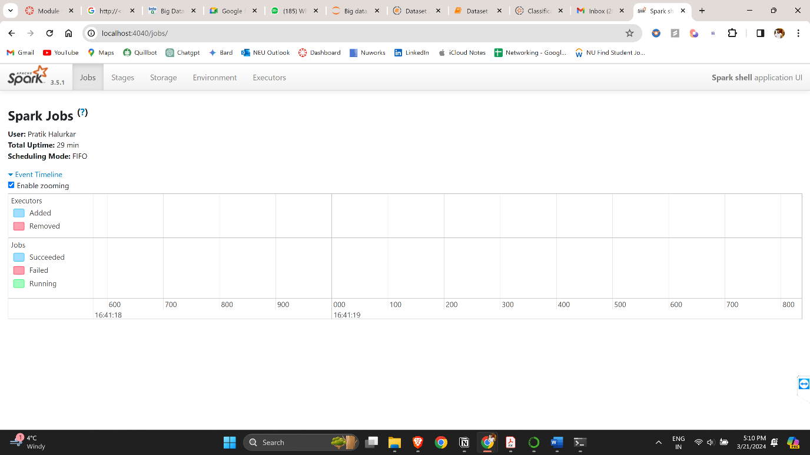

Pratik Amol Halurkar

Module 5 assignment

ALY6110: Big Data and Data Management (CRN: 20389)

Prof. Daya Rudhramoorthi

3/24/2024

# Introduction

Our assignment focuses on implementing a word count application using
Apache Spark. First, we install the Java Development Kit (JDK) and Spark
following provided instructions. We then cache the README.md file and
proceed to count its words. Questions include identifying the frequency
of "Hadoop," the most common word, and the least common word.
Additionally, we examine the Spark web console to determine the duration
of the word count job. This exercise enables us to gain practical
experience with big data processing using Spark.

# Outputs Screenshots

# Explanation

The Word Count application in Apache Spark serves as a fundamental
example demonstrating the capabilities of the Spark framework in data
analytics tasks. Here's a breakdown of the steps involved:

1.  **JDK and Spark Installation**: Both were installed on my local
    machine beforehand.

2.  **Import Spark Context**: In the provided code snippet, we first
    import the necessary classes from the Spark Context module. Spark
    Context serves as the entry point for interacting with Spark
    functionalities.

3.  **Read Text File**: We define a variable **txtFile** containing the
    path to the input text file, typically named "README.md".
    Subsequently, we utilize the **sc.textFile()** function to read the
    contents of the text file into an RDD (Resilient Distributed
    Dataset), denoted as **txtData**. RDDs are Spark's primary
    abstraction for working with distributed data.

4.  **Cache RDD**: To optimize performance, we invoke the **cache()**
    function on the **txtData** RDD. This action instructs Spark to
    store the RDD in memory, reducing computational overhead by avoiding
    recomputation of the RDD during subsequent operations. However, it's
    important to note that caching is a lazy operation, meaning the
    actual caching occurs only when an action is performed on the RDD.

5.  **Count Lines**: We use the **count()** function to determine the
    number of lines present in the text file. This action provides a
    basic insight into the size of the dataset being processed.

6.  **Perform Word Count**: Finally, we execute the word count operation
    on the text data. This involves a sequence of transformations and
    actions on the RDD. We first split each line into individual words
    using **flatMap()**, then assign a count of 1 to each word using
    **map()**, and finally aggregate the counts for each word using
    **reduceByKey()**. The resulting RDD **wcData** contains tuples of
    words and their respective counts.

7.  **Display Word Counts**: To visualize the word count results, we use
    the **collect()** function to retrieve all elements of the RDD and
    **foreach(println)** to print each word count pair to the console.
    This provides a comprehensive overview of the frequency of each word
    in the text file.

8.  By navigating to the **web console** (http://\<\>:4040/jobs), we
    gain insights into the execution details of the word count job.
    Specifically, we focus on determining the duration of the word count
    job, which provides valuable information about the efficiency of the
    Spark application.

9.  In this particular instance, the total uptime of the Spark
    application, including the execution of the word count job, was
    measured to be 29 minutes. Within this timeframe, we can extract the
    specific duration of the word count job from the Spark web console.

# Questions

1.  **How many times is the word "Hadoop" counted when the tutorial has
    printed out all the word counts?**

> The word "Hadoop" appears 3 times in the word count output.

2.  **Which is the most common word used in the file? How many times
    does the word occur?**

> The most common word is **"Spark"**, which occurs 15 times.

3.  **Which word occurs the fewest times? How many times does the word
    occur?**

> Several words occur only once. One of them is **"pandas"**, which
> occurs only once.

# Conclusion

In conclusion, the implementation of the Word Count application using
Apache Spark illustrates the platform's efficacy in processing and
analyzing large volumes of textual data. By following the prescribed
steps, including the installation of the Java Development Kit (JDK),
setting up Spark, and executing the word count code, we gained practical
experience in utilizing Spark's API for data analytics tasks.

Through the utilization of RDDs and Spark transformations and actions,
we efficiently processed the input text file, obtaining valuable
insights such as the total number of lines and the frequency of
individual words. Furthermore, by leveraging the Spark web console, we
analyzed the performance metrics of the word count job, including its
duration.

Overall, this exercise not only provided a foundational understanding of
Spark's capabilities but also highlighted its potential for real-world
big data processing applications. As we continue to explore advanced use
cases of Spark in future endeavors, this experience serves as a solid
foundation for further exploration and innovation in the realm of data
analytics and processing.

# References

Penchikala, S. (2015, January 30). *Big Data Processing with Apache
Spark – Part 1: Introduction*. InfoQ.
<https://www.infoq.com/articles/apache-spark-introduction/>

Top of Form
